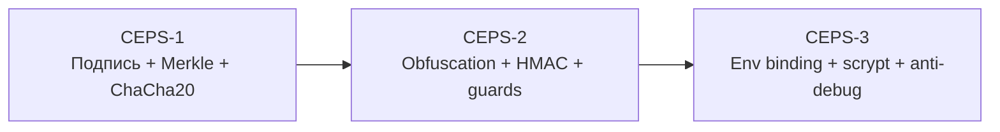
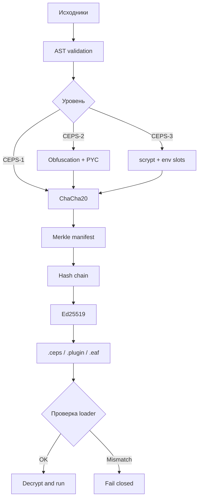

# CEPS

**CEPSbuilder** — защищённый конвейер сборки плагинов exteraGram. Автор: `@Coder_Minecraft`.

## Возможности

| Область | Реализация | Результат |
|---|---|---|
| Авторство | Ed25519 | Только владелец ключа подписывает релиз |
| Целостность | Merkle + HMAC | Подмена payload обнаруживается до запуска |
| История | Hash-chain сборок | Релизы нельзя незаметно переписать |
| Конфиденциальность | ChaCha20 | Исходники не лежат открыто в контейнере |
| Снижение читаемости | AST obfuscation, `--pyc`, `--rt-pyc` | Распространение без `.py` |
| Защита от AI-редактирования | AI-GUARD, SHA-256 seal | Изменённый loader отказывается запускаться |
| Runtime | seal, guards, fail-closed | Повреждённый loader останавливается |
| Привязка | CEPS-3 env-slots + scrypt | Ключ связан с окружением Telegram |

### Anti-AI guard

`CEPS AI-GUARD` — дополнительный слой целостности от автоматического редактирования. В [`ceps_installer.py`](ceps_installer.py) хранятся notice-строки и SHA-256 seal; при их изменении loader останавливается до расшифровки payload. Guard включён в сборку по умолчанию: отдельный флаг не нужен.

Чтобы добавить его в собственный плагин, оставьте обычную сборку включённой и не удаляйте `ceps_installer.py`:

```bash
python CEPSbuilder/cepsbuilder.py build my_plugin --obf --pyc
```

Для второго слоя guard в зашифрованных `.py` задайте в `ceps.json`:

```json
{
  "guards": true,
  "guards_every": 3,
  "guards_max": 800
}
```

`"guards": false` отключает только вставки внутри payload; seal в loader остаётся включённым. Реальную криптографическую защиту обеспечивают Ed25519, HMAC, Merkle/hash-chain, шифрование и CEPS-3 env binding.

## Уровни защиты



| Уровень | Включает | Сценарий |
|---|---|---|
| **CEPS-1** | Ed25519, Merkle, chain, ChaCha20 | Целостность и происхождение |
| **CEPS-2** | CEPS-1 + obfuscation, HMAC, guards, PYC | Раздача без открытых исходников |
| **CEPS-3** | CEPS-2 + env binding, scrypt, anti-debug, seal | Критичные/device-bound сборки |

Клиентская защита не делает исполняемый код абсолютно неразрушаемым: payload расшифровывается на устройстве пользователя.

## Сравнение с ElyxBuilder

- [shareui/ElyxBuilder](https://github.com/shareui/ElyxBuilder) — upstream CLI для ElyxCore;
- [Kangel-Plugins/ElyxBuilder](https://github.com/Kangel-Plugins/ElyxBuilder) — fork с watch-режимом и исправлениями UX.

Сравнение составлено по публичным README репозиториев на 12 сентября 2026 года.

| Возможность | CEPSbuilder | shareui | Kangel |
|---|:---:|:---:|:---:|
| Scaffold и AST validation | ✅ | ✅ | ✅ |
| Python 3.11 `.pyc` | ✅ | ✅ | ✅ |
| AES/ZipCrypto | Совместимый ChaCha20 payload | ✅ | ✅ |
| Ed25519 подпись | ✅ | — | — |
| Merkle и hash-chain | ✅ | — | — |
| HMAC целостности | ✅ | — | — |
| Env/device binding | ✅ CEPS-3 | — | — |
| scrypt KDF | ✅ CEPS-3 | — | — |
| Anti-debug / double seal | ✅ CEPS-3 | — | — |
| Watch mode | ✅ | — | ✅ |
| Прогресс сборки | CLI-логи | базовый CLI | ✅ |
| Лицензия | проектная | MIT | MIT |

### Шкала фокуса

`█` — функция заявлена и реализована в конвейере; `░` — не заявлена в README сравниваемого проекта.

| Фокус | CEPS | shareui | Kangel |
|---|---:|---:|---:|
| Упаковка | █████ | █████ | █████ |
| `.pyc` | █████ | █████ | █████ |
| Криптографическое авторство | █████ | ░░░░░ | ░░░░░ |
| Контроль целостности | █████ | ░░░░░ | ░░░░░ |
| Runtime hardening | █████ | ░░░░░ | ░░░░░ |
| Watch/developer UX | ██░░░ | ███░░ | █████ |

ElyxBuilder оптимален для лёгкого сценария scaffold → compile → package. CEPS добавляет подписанную цепочку поставки и профили защиты. Их можно использовать вместе: Elyx для упаковки ElyxCore, CEPS для подписанного распространения payload.

## Поток сборки



## Быстрый старт

### 1. Подготовка

Нужен Python 3.10 или новее. Python 3.11 требуется для флагов `--pyc` и `--rt-pyc`.

```bash
git clone https://github.com/m4rker20-rgb/CEPS.git
cd CEPS
```

### 2. Создание своего плагина

```bash
python CEPSbuilder/cepsbuilder.py new examples/my_plugin --name "My Plugin" --author @Coder_Minecraft
```

| Аргумент `new` | Назначение |
|---|---|
| `PROJECT` | каталог проекта |
| `--name` | отображаемое имя (обязательно) |
| `--author` | автор (обязательно) |
| `--id` | идентификатор файлов |
| `--desc` | описание плагина |
| `--no-keygen` | не создавать ключ автоматически |

Измените `PROJECT/src/main.py`. В `ceps.json` задайте `entry` и файлы в `encrypt`.

Команда `new` сразу создаёт локальный ключ подписи в `PROJECT/ceps_keys/`. Этот каталог добавлен в `.gitignore`: приватный ключ нельзя отправлять в GitHub. Если каркас был создан с `--no-keygen` или вы скачали пример из репозитория, создайте ключ вручную:

```bash
python CEPSbuilder/cepsbuilder.py keygen --out examples/my_plugin/ceps_keys/my_plugin.key
```

Путь в команде должен совпадать со значением `key` в `ceps.json`. Для `examples/ceps_empty_plugin` это `ceps_keys/ceps_empty.key`.

### 3. Сборка

```bash
python CEPSbuilder/cepsbuilder.py build examples/my_plugin --obf --pyc --rt-pyc -v
```

| Аргумент `build` | Назначение |
|---|---|
| `-o, --out DIR` | каталог артефактов |
| `--note TEXT` | заметка в hash-chain |
| `--elyx` | создать `.eaf` |
| `--obf` / `--no-obf` | включить/выключить AST-обфускацию |
| `--zlib` | zlib+base64 launcher |
| `--pyc` | payload без `.py`, marshal Python 3.11 |
| `--rt-pyc` | runtime тоже в marshal-формате |
| `--allow-envsim` | ПК-заглушки для теста CEPS-3 |
| `-v, --verbose` | подробный лог |

Результаты находятся в `PROJECT/builds/`: `.ceps`, `.py`, `.plugin`, а с `--elyx` ещё `.eaf`.

### 4. Watch mode

Watch следит за исходниками и `ceps.json`, игнорирует `builds/`, `.git`, ключи и кэш, а после изменения запускает сборку:

```bash
python CEPSbuilder/cepsbuilder.py watch examples/my_plugin --obf --pyc -v
```

При запуске watch сборка выполняется сразу, затем проект проверяется каждые `--interval SECONDS` (по умолчанию `1.0`). Флаг `--once` означает «собрать один раз и завершиться» — это удобно для CI и проверки конфигурации. Остановка обычного режима: `Ctrl+C`. Ошибка сборки выводится в консоль, наблюдение продолжается.

Пример для скачанного демонстрационного проекта:

```bash
python CEPSbuilder/cepsbuilder.py keygen --out examples/ceps_empty_plugin/ceps_keys/ceps_empty.key
python CEPSbuilder/cepsbuilder.py watch examples/ceps_empty_plugin --once --no-obf
```

### 5. Проверка подписи

```bash
python CEPSbuilder/cepsbuilder.py verify examples/my_plugin/builds/my_plugin.ceps --pubkey PUBLIC_KEY_HEX
```

## Проверка

```bash
for test_file in CEPSbuilder/test_*.py; do python "$test_file"; done
python CEPSbuilder/cepsbuilder.py selftest
```

CI: [`.github/workflows/ci.yml`](.github/workflows/ci.yml). Подробности: [`CEPSbuilder/README.md`](CEPSbuilder/README.md). Уязвимости: [`SECURITY.md`](SECURITY.md).

## Лицензия

Проект распространяется под **CEPS License v1.0** (кастомная source-available
лицензия, не OSI) — см. файл [`LICENSE`](LICENSE).

Ключевое условие: любой плагин, собранный (упакованный) через CEPSbuilder,
**обязан явно указывать, что собран с помощью CEPS** — фразу `Built with CEPS`
и ссылку на репозиторий `https://github.com/m4rker20-rgb/CEPS`. Билдер
вписывает эту пометку в каждый артефакт автоматически:

- строка-заголовок в начале `.py` / `.plugin` / `.eaf` лоадера;
- атрибут `__built_with__` внутри лоадера;
- поле `built_with` в манифесте `.ceps` и в meta Elyx-обёртки.

Убирать или прятать эту пометку из собранного плагина запрещено лицензией.

