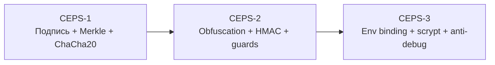
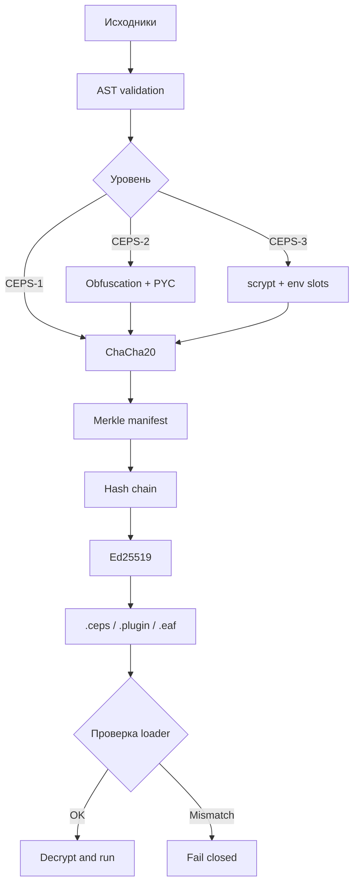

# CEPS

**CEPSbuilder** — защищённый конвейер сборки плагинов exteraGram. Автор: `@Coder_Minecraft`.

## Возможности

| Область | Реализация | Результат |
|---|---|---|
| Авторство | Ed25519 | Только владелец ключа подписывает релиз |
| Целостность | Merkle + HMAC | Подмена payload обнаруживается до запуска |
| История | Hash-chain сборок | Релизы нельзя незаметно переписать |
| Конфиденциальность | ChaCha20 | Исходники не лежат открыто в контейнере |
| Снижение читаемости | AST obfuscation, `--pyc`, `--rt-pyc` | Распространение без `.py` |
| Runtime | seal, guards, fail-closed | Повреждённый loader останавливается |
| Привязка | CEPS-3 env-slots + scrypt | Ключ связан с окружением Telegram |

## Уровни защиты



| Уровень | Включает | Сценарий |
|---|---|---|
| **CEPS-1** | Ed25519, Merkle, chain, ChaCha20 | Целостность и происхождение |
| **CEPS-2** | CEPS-1 + obfuscation, HMAC, guards, PYC | Раздача без открытых исходников |
| **CEPS-3** | CEPS-2 + env binding, scrypt, anti-debug, seal | Критичные/device-bound сборки |

Клиентская защита не делает исполняемый код абсолютно неразрушаемым: payload расшифровывается на устройстве пользователя.

## Сравнение с ElyxBuilder

- [shareui/ElyxBuilder](https://github.com/shareui/ElyxBuilder) — upstream CLI для ElyxCore;
- [Kangel-Plugins/ElyxBuilder](https://github.com/Kangel-Plugins/ElyxBuilder) — fork с watch-режимом и исправлениями UX.

Сравнение составлено по публичным README репозиториев на 12 сентября 2026 года.

| Возможность | CEPSbuilder | shareui | Kangel |
|---|:---:|:---:|:---:|
| Scaffold и AST validation | ✅ | ✅ | ✅ |
| Python 3.11 `.pyc` | ✅ | ✅ | ✅ |
| AES/ZipCrypto | Совместимый ChaCha20 payload | ✅ | ✅ |
| Ed25519 подпись | ✅ | — | — |
| Merkle и hash-chain | ✅ | — | — |
| HMAC целостности | ✅ | — | — |
| Env/device binding | ✅ CEPS-3 | — | — |
| scrypt KDF | ✅ CEPS-3 | — | — |
| Anti-debug / double seal | ✅ CEPS-3 | — | — |
| Watch mode | Планируется | — | ✅ |
| Прогресс сборки | CLI-логи | базовый CLI | ✅ |
| Лицензия | проектная | MIT | MIT |

### Шкала фокуса

`█` — функция заявлена и реализована в конвейере; `░` — не заявлена в README сравниваемого проекта.

| Фокус | CEPS | shareui | Kangel |
|---|---:|---:|---:|
| Упаковка | █████ | █████ | █████ |
| `.pyc` | █████ | █████ | █████ |
| Криптографическое авторство | █████ | ░░░░░ | ░░░░░ |
| Контроль целостности | █████ | ░░░░░ | ░░░░░ |
| Runtime hardening | █████ | ░░░░░ | ░░░░░ |
| Watch/developer UX | ██░░░ | ███░░ | █████ |

ElyxBuilder оптимален для лёгкого сценария scaffold → compile → package. CEPS добавляет подписанную цепочку поставки и профили защиты. Их можно использовать вместе: Elyx для упаковки ElyxCore, CEPS для подписанного распространения payload.

## Поток сборки



## Быстрый старт

```bash
python CEPSbuilder/cepsbuilder.py new examples/my_plugin --name "My Plugin" --author @Coder_Minecraft
python CEPSbuilder/cepsbuilder.py build examples/my_plugin --obf --pyc --rt-pyc
python CEPSbuilder/cepsbuilder.py verify examples/my_plugin/builds/my_plugin.ceps --pubkey PUBLIC_KEY_HEX
```

## Проверка

```bash
for test_file in CEPSbuilder/test_*.py; do python "$test_file"; done
python CEPSbuilder/cepsbuilder.py selftest
```

CI: [`.github/workflows/ci.yml`](.github/workflows/ci.yml). Подробности: [`CEPSbuilder/README.md`](CEPSbuilder/README.md). Уязвимости: [`SECURITY.md`](SECURITY.md).
